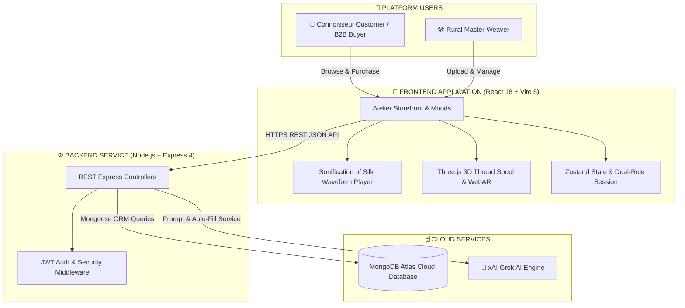
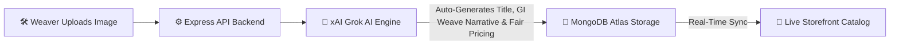
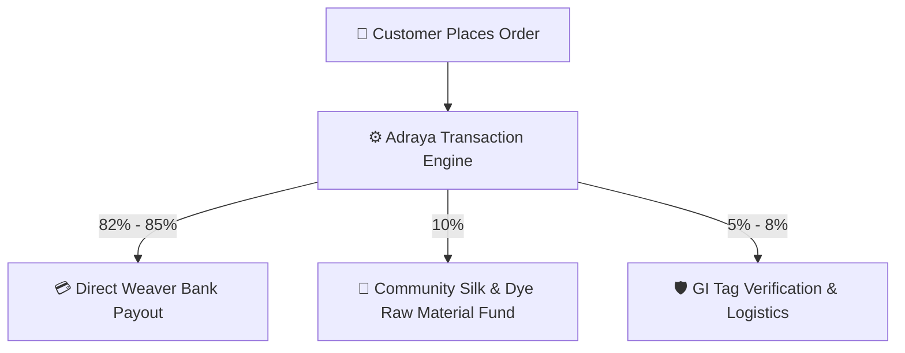
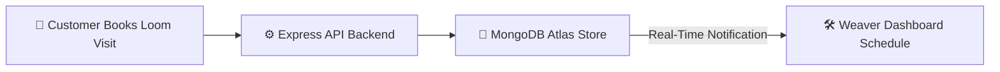

# 👑 ADRAYA (WeaveHeritage Lux) — Indian Luxury Heritage Atelier

<p align="center">
  
</p>

<p align="center">
  <strong>Direct Pit Loom Handloom Atelier • GI-Certified Heritage Provenance • Grok AI Engine • Interactive 3D Canvas</strong>
</p>

<p align="center">
  <a href="https://github.com/HardikMathur11/Adraya"></a>
  <a href="#-tech-stack"></a>
  <a href="#-system-architecture"></a>
  <a href="#-grok-ai-engine-integration"></a>
</p>

---

## 🔗 Production Links

- **🌐 GitHub Repository**: [https://github.com/HardikMathur11/Adraya](https://github.com/HardikMathur11/Adraya)
- **🚀 Live Backend Server (Vercel)**: [https://adraya-phc4.vercel.app/api/health](https://adraya-phc4.vercel.app/api/health)
- **🛍️ Live Storefront Prototype**: [https://adraya.vercel.app](https://adraya.vercel.app)

---

## 🌟 Executive Summary & Vision

**Adraya** is an end-to-end direct-from-loom luxury handloom platform designed to preserve and scale India’s living textile heritage. By directly connecting rural master weavers (*Shilp Guru and National Award recipients*) with global textile connoisseurs and commercial luxury buyers, Adraya eliminates exploitative middleman networks, ensuring **82%+ direct bank payouts** to weaving families.

Adraya offers a dual-pathway ecosystem:
1. **Luxury Retail**: For premium individual connoisseurs seeking rare, authentic, certified drapes.
2. **B2B Heritage Sourcing**: For design houses, boutiques, and exporters looking to secure authentic, cluster-level orders directly from rural artisans.

---

## ⚡ The Problem vs. The Solution

### ❌ The Problem
- **Middleman Exploitation**: Rural weavers operate through complex distributor networks, capturing under 15% of the end consumer retail price and leaving them financially vulnerable.
- **Exclusivity Deficit**: High-net-worth individual (HNWI) buyers are willing to pay premium prices but lack access to verified origin records, artisan lineage stories, and guaranteed handloom authenticity.
- **Traceability Gap**: Designers and boutique owners face supply chain uncertainty, quality fluctuations, and counterfeit products when purchasing bulk handlooms.

### ✔️ The Solution
- **Atelier Direct-to-Consumer Model**: Direct selling channels with verified **82%+ direct-to-weaver bank payouts** visible on the digital invoice.
- **Multilingual Low-Bandwidth Onboarding**: Master weavers easily register using vocal guidance, upload products, and manage their listings.
- **Traceability Passports**: QR-linked interactive digital passports containing loom hours, yarn counts, and Geographical Indication (GI) registry certifications.

---

## 💎 Platform Features

### 1. 🧵 Interactive 3D Gold Thread Spool
- **Description**: Embedded in the homepage hero header using WebGL via `@react-three/fiber` and `@react-three/drei`.
- **Purpose**: A floating, interactive 3D pure gold thread ring reacts to user mouse drags and spins organically over a live video broadcast stream of rural artisan weavers operating pit looms.
- **Aesthetic**: Blends modern 3D technology with ancient craft, establishing an immediate luxury digital atmosphere.

### 2. 🔍 High-Resolution 4-Photo Drape Inspector
- **Description**: Features a specialized photo carousel grid on the product details page showing close-ups of the pure zari borders, heavy thread density, macro silk fibers, and full saree length.
- **Purpose**: Mimics the physical touch and feel of luxury textiles, giving buyers the confidence to inspect hand-spun organic mulberry silks from their screens.

### 3. 👚 AI Virtual Try-On
- **Description**: Accessible via the **"AI Try-on Saree"** button on the product details page.
- **Purpose**: Connoisseurs can upload personal portraits, and the platform’s layout simulates a realistic visualization of the handloom drape wrapped around them.

### 4. 🕶️ 3D WebAR Loom Room Placement
- **Description**: Built using AR Quick Look (iOS) and Model Viewer (Android).
- **Purpose**: Clicking **"View Loom in 3D AR"** projects a life-sized, high-fidelity 3D virtual pit loom weaving machine directly onto the user's living room floor using mobile camera augmented reality.

### 5. 🤖 24/7 Grok AI Heritage Guide
- **Description**: Floating AI Chatbot widget present across all pages connected to xAI's `grok-beta` engine.
- **Purpose**: Automatically educates global buyers on the Geographical Indication (GI) origin, the historical motifs of the drape, silk care guidelines, and styling advice.

### 6. 🏢 B2B Bulk Wholesale & Cluster RFQ Portal
- **Description**: Dedicated business client panel (`/b2b`) allowing commercial buyers to submit Requests for Quotations (RFQs).
- **Purpose**: Facilitates corporate gifting or bulk boutique orders directly from village weaver cooperative clusters, complete with target budget and deadline specifications.

### 7. 💳 82%+ Direct Weaver Payout Tracker
- **Description**: Transparent database ledger tracking direct bank payouts for every single listing.
- **Purpose**: Guarantees that at least 82% to 85% of the transaction fee is wired directly to the specific weaver’s Bank of India/SBI account, with complete payout transparency shown on the customer invoice.

### 8. 🛠️ Real-time Loom Visit Bookings
- **Description**: Experiential tourism module allowing premium buyers to book physical weaving workshops, local village heritage tours, and live loom studio slots.

---

## 🛠️ Tech Stack

| Layer | Technology Used | Implementation Purpose |
| :--- | :--- | :--- |
| **Frontend** | **React 18 / Vite 5** | High-speed Single Page Application with optimized bundle splitting |
| **Styling** | **Tailwind CSS** | Premium custom typography and theme colors with gold zari accents |
| **3D Engine** | **Three.js WebGL** | `@react-three/fiber` & `@react-three/drei` interactive spool canvases |
| **State** | **Zustand** | Multi-role user session stores and lightweight cart management |
| **Backend** | **Node.js / Express** | REST API Microservice controllers for products, authentication, and visits |
| **Database** | **MongoDB Atlas** | Mongoose ORM managing users, products, and loom visit bookings |
| **AI Layer** | **xAI Grok API** | Powered by `grok-beta` for chatbot, auto-fill, and story generation |
| **Auth** | **JWT & Bcrypt** | Secure encryption for Customer and Weaver profiles |

---

## 🏗️ System Architecture



---

## 🔄 Core Platform Workflows

### 1. Weaver Onboarding & AI Listing Workflow



### 2. Direct Payout & Pricing Split Logic



### 3. Loom Visit & Community Booking Workflow



---

## 💻 Local Setup & Installation

### Prerequisites
- Node.js v18.0.0 or higher
- npm v9.0.0 or higher

### 1. Backend Service Setup
```bash
# Navigate to Backend directory
cd Backend

# Install dependencies
npm install

# Seed initial database (Populates master accounts & handloom products in MongoDB Atlas)
npm run seed

# Launch Backend Server (http://localhost:5001)
npm run dev
```

### 2. Frontend Storefront Setup
```bash
# Open a new terminal and navigate to Frontend directory
cd Frontend

# Install dependencies
npm install

# Launch Vite Development Server (http://localhost:5173)
npm run dev
```

---

<p align="center">
  Crafted with precision for India's Living Handloom Heritage.
</p>
