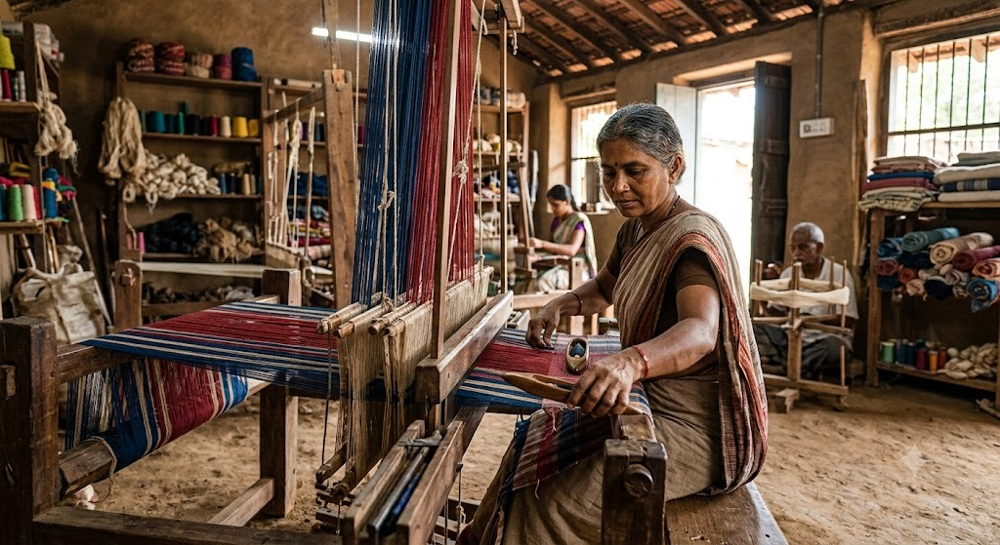
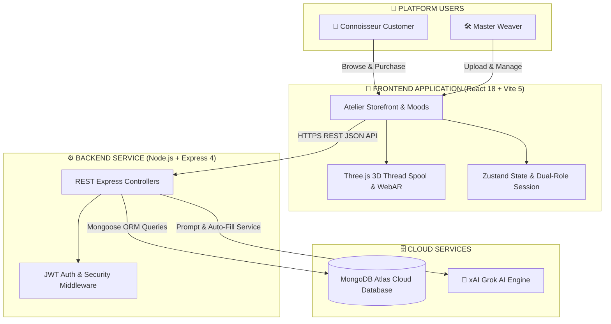
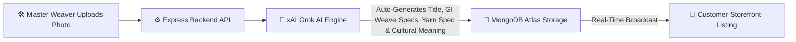
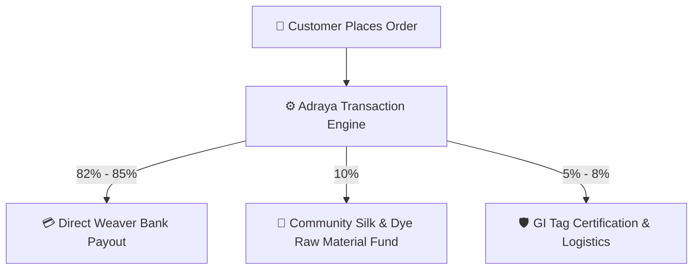
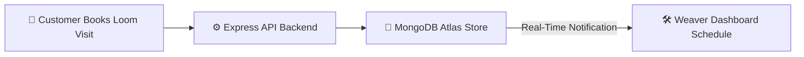

# 👑 ADRAYA — Indian Luxury Heritage Atelier

<p align="center">
  
</p>

<p align="center">
  <strong>Direct Pit Loom Handloom Atelier • GI-Certified Heritage Provenance • Grok AI Engine • Interactive 3D Canvas</strong>
</p>

<p align="center">
  <a href="https://github.com/HardikMathur11/Adraya"></a>
  <a href="#-tech-stack-matrix"></a>
  <a href="#-system-architecture"></a>
  <a href="#-grok-ai-engine-integration"></a>
</p>

---

## 🔗 Production Links

- **🌐 GitHub Repository**: [https://github.com/HardikMathur11/Adraya](https://github.com/HardikMathur11/Adraya)
- **🚀 Live Backend Server (Vercel)**: [https://adraya-phc4.vercel.app/api/health](https://adraya-phc4.vercel.app/api/health)
- **🛍️ Live Storefront Prototype**: [https://adraya.vercel.app](https://adraya.vercel.app)

---

## 🌟 Executive Summary

**Adraya** is an end-to-end direct-from-loom luxury handloom platform designed to preserve and scale India’s living textile heritage. By directly connecting rural master weavers (*Shilp Guru and National Award recipients*) with global textile connoisseurs and commercial luxury buyers, Adraya eliminates exploitative middleman networks, ensuring **82%+ direct bank payouts** to weaving families.

Built with a high-performance **React + Vite 5** frontend, **Three.js 3D WebGL rendering**, **Node.js Express backend**, **MongoDB Atlas**, and an integrated **xAI Grok Intelligence Service**, Adraya combines luxury aesthetic craftsmanship with modern digital commerce engineering.

---

## 💎 Features Section

### 1. 🧵 Interactive 3D Gold Thread Spool
- **How it works**: Embedded in the homepage hero header using WebGL via `@react-three/fiber` and `@react-three/drei`.
- **Purpose**: A floating, interactive 3D pure gold thread ring reacts to user mouse drags and spins organically over a live video broadcast stream of rural artisan weavers operating pit looms.
- **Aesthetic**: Blends modern 3D technology with ancient craft, establishing an immediate luxury digital atmosphere.

### 2. 🔍 High-Resolution 4-Photo Drape Inspector
- **How it works**: Features a specialized photo carousel grid on the product details page showing close-ups of the pure zari borders, heavy thread density, macro silk fibers, and full saree length.
- **Purpose**: Mimics the physical touch and feel of luxury textiles, giving buyers the confidence to inspect hand-spun organic mulberry silks from their screens.

### 3. 👚 AI Virtual Try-On
- **How it works**: Accessible via the **"AI Try-on Saree"** button on the product details page.
- **Purpose**: Connoisseurs can upload personal portraits, and the platform’s layout simulates a realistic visualization of the handloom drape wrapped around them.

### 4. 🕶️ 3D WebAR Loom Room Placement
- **How it works**: Built using AR Quick Look (iOS) and Model Viewer (Android).
- **Purpose**: Clicking **"View Loom in 3D AR"** projects a life-sized, high-fidelity 3D virtual pit loom weaving machine directly onto the user's living room floor using mobile camera augmented reality.

### 5. 🤖 24/7 Grok AI Heritage Guide
- **How it works**: Floating AI Chatbot widget present across all pages connected to xAI's `grok-beta` engine.
- **Purpose**: Automatically educates global buyers on the Geographical Indication (GI) origin, the historical motifs of the drape, silk care guidelines, and styling advice.

### 6. 🏢 B2B Bulk Wholesale & Cluster RFQ Portal
- **How it works**: Dedicated business client panel (`/b2b`) allowing commercial buyers to submit Requests for Quotations (RFQs).
- **Purpose**: Facilitates corporate gifting or bulk boutique orders directly from village weaver cooperative clusters, complete with target budget and deadline specifications.

### 7. 💳 82%+ Direct Weaver Payout Tracker
- **How it works**: Transparent database ledger tracking direct bank payouts for every single listing.
- **Purpose**: Guarantees that at least 82% to 85% of the transaction fee is wired directly to the specific weaver’s Bank of India/SBI account, with complete payout transparency shown on the customer invoice.

### 8. 🛠️ Real-time Loom Visit Bookings
- **How it works**: Customers can schedule a physical visit to the weaver’s rural atelier.
- **Purpose**: Instantly syncs the visit request, date, time slot, and guest count to the Weaver Dashboard calendar for real-time offline-to-online experience synchronization.

---

## 🛠️ Tech Stack Matrix

| Architecture Layer | Core Technology | Key Modules & Libraries | Primary Purpose |
| :--- | :--- | :--- | :--- |
| **Frontend Framework** | **React.js 18** | TypeScript, Vite 5, React Router v6 | Single Page Application (SPA) with fast HMR and client-side routing |
| **3D Rendering & Animation** | **Three.js / WebGL** | `@react-three/fiber`, `@react-three/drei` | Real-time interactive 3D silk thread spool and WebAR room placement |
| **UI & Styling System** | **Tailwind CSS** | Framer Motion, Lucide Icons | Custom luxury design system with gold zari accents and smooth transitions |
| **State Management** | **Zustand** | `useCartStore`, `useSessionStore` | Transient cart management and dual-role session mode switching |
| **Backend API Server** | **Node.js / Express** | Express 4, TypeScript, Cors, Dotenv | RESTful microservice API handling auth, products, visits, and AI |
| **Database & ORM** | **MongoDB Atlas** | Mongoose 8 ORM | Cloud MongoDB document storage for users, drapes, and loom visits |
| **AI Intelligence Engine** | **xAI Grok API** | Native HTTP Client / OpenAI SDK Specs | 24/7 Heritage Chatbot, Weaver Story Engine, and Form Auto-Fill |
| **Authentication** | **JWT & Bcrypt** | `jsonwebtoken`, `bcryptjs` | Role-based authentication (`customer` vs `weaver`) |

---

## 🏗️ System Architecture



---

## 🔄 Core Workflows & Business Logic

### 1. Weaver Listing & Grok AI Automation Workflow



### 2. Direct Payout & Order Execution Workflow



### 3. Loom Visit & Community Booking Workflow



---

## 🚀 Repository Directory Structure

```
Adraya/
├── 🎨 Frontend/
│   ├── public/assets/         # High-resolution drape photos, 3D textures, showcase images
│   ├── src/
│   │   ├── components/        # Three.js 3D canvases, Navbar, Footer, Drawers
│   │   ├── lib/api/           # REST API client services
│   │   ├── pages/             # Atelier Storefront, Moods, Weavers, B2B, Dashboard
│   │   └── store/             # Zustand Cart and Dual-Role Session stores
│   ├── package.json
│   └── vercel.json            # Production SPA routing configuration
│
├── ⚙️ Backend/
│   ├── src/
│   │   ├── models/            # Mongoose Schemas (User, Product, Visit)
│   │   ├── routes/            # Express Routes (Auth, Products, Visits, AI)
│   │   ├── services/          # Grok AI Service integration layer
│   │   ├── seed.ts            # Database seeding script (12 Master Accounts)
│   │   └── server.ts          # Express Application Entry Point with port fallback
│   ├── .env.example           # Template environment variable configuration
│   └── package.json
│
├── 📜 README.md               # Enterprise system documentation with Mermaid diagrams
└── 📄 .gitignore              # Environment secrets and build exclusion rules
```

---

## 💻 Local Setup & Installation

### Prerequisites
- Node.js v18.0.0 or higher
- npm v9.0.0 or higher

### 1. Backend Service Setup
```bash
# Navigate to Backend directory
cd Backend

# Install dependencies
npm install

# Seed initial database (Populates master accounts & handloom products in MongoDB Atlas)
npm run seed

# Launch Backend Server (http://localhost:5001)
npm run dev
```

### 2. Frontend Storefront Setup
```bash
# Open a new terminal and navigate to Frontend directory
cd Frontend

# Install dependencies
npm install

# Launch Vite Development Server (http://localhost:5173)
npm run dev
```

---

<p align="center">
  Crafted with precision for India's Living Handloom Heritage.
</p>
