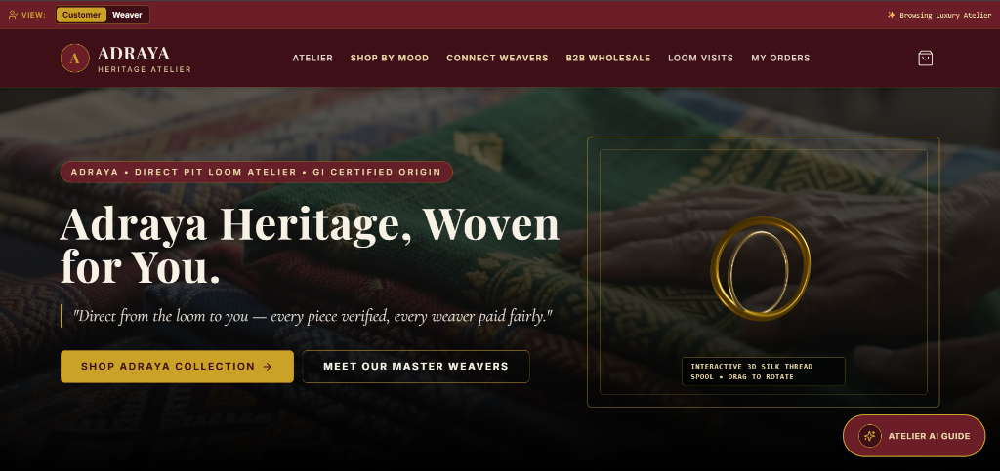
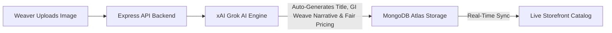
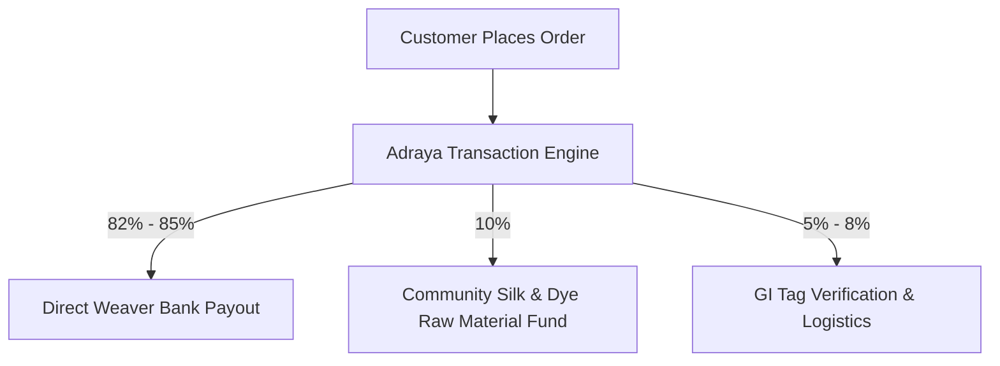
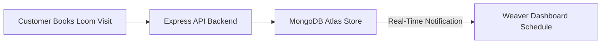

# ✦ ADRAYA — Indian Luxury Heritage Atelier

<p align="center">
  
</p>

<p align="center">
  <strong>Direct Pit Loom Handloom Atelier • GI-Certified Heritage Provenance • Grok AI Engine • Interactive 3D Canvas</strong>
</p>

<p align="center">
  <a href="https://github.com/HardikMathur11/Adraya"></a>
  <a href="#-tech-stack"></a>
  <a href="#-system-architecture"></a>
  <a href="#-grok-ai-engine-integration"></a>
</p>

---

## ✦ Production Links

- **GitHub Repository**: [https://github.com/HardikMathur11/Adraya](https://github.com/HardikMathur11/Adraya)
- **Live Backend Server**: [https://adraya-phc4.vercel.app/api/health](https://adraya-phc4.vercel.app/api/health)
- **Live Storefront Prototype**: [https://adraya.vercel.app](https://adraya.vercel.app)

---

## ✦ The Problem Statement

Traditional handloom weaving represents one of the most culturally significant craft sectors in India, yet it faces deep structural inefficiencies that threaten both the survival of the art and the livelihoods of rural artisans:

1. **Middleman Monopolization & Margin Loss**: 
   Rural weavers typically operate through complex, multi-tiered networks of local traders, master weavers, and wholesale agents. These middlemen capture up to **80% to 85% of the retail price** of luxury handloom drapes. As a result, the actual artisan is left financially vulnerable, earning below-minimum wages for months of high-skill pit loom labor.
   
2. **Connection & Visibility Gap**: 
   Highly talented, lineage-based master weavers located in remote villages (such as Pochampally, Kanchipuram, or Yeola) have **no direct connection channel to global premium consumers, design houses, and boutique buyers**. Premium buyers and export houses are willing to pay premium luxury rates for authentic handlooms, but they remain completely isolated from the actual weavers who possess these multi-generational skills.

3. **Authenticity & Provenance Deficit**: 
   The luxury market operates on trust. However, premium buyers face a market saturated with cheap, powerloom-made counterfeits falsely marketed as handmade silk sarees. Without verified certificates of origin, tracing Geographical Indication (GI) tags, or knowing how many loom hours were invested, premium buyers are hesitant to make high-value purchases online.

4. **Digital & Language Exclusions**: 
   Rural weaving clusters are often excluded from modern commerce due to complex setup flows, language barriers, and the need for professional digital branding, preventing them from presenting their masterpieces on a global stage.

---

## ✦ The Solution: Adraya

Adraya is an end-to-end luxury-focused digital atelier that transforms the handloom ecosystem. It treats every handloom masterpiece like a curated heritage object, where the story of the artisan, the scarcity of the weave, and the time invested become the key value drivers:

### 1. Direct-to-Consumer (D2C) Atelier Network
By bridging the gap between rural master weavers and global buyers, Adraya bypasses middlemen entirely. Every transaction guarantees **82%+ direct bank payouts** wired directly to the weaver's account, bringing financial independence and pride to handloom communities.

### 2. Verified Traceability & QR Passports
Each product is issued a QR-based **Digital Heritage Passport**. Scanning the passport reveals the weaver’s profile, village, craft cluster lineage, verified yarn counts, days of labor, and official Ministry of Textiles GI-tagged origin certificates.

### 3. Dual-Pathway Market Access
- **Luxury Retail**: An editorial, museum-grade gallery where premium buyers browse rare silks by mood, occasion, and technique.
- **B2B Sourcing Portal**: Enables designers, boutiques, and exporters to request custom orders in bulk from entire cooperative weaving clusters, ensuring dependable volumes without sacrificing artisan quality.

### 4. AI-Driven Artisan Empowerment
Master weavers can register and upload products in a simple, multilingual environment. Our integrated **Grok AI Brand Assistant** automatically translates listings and generates professional provenance narratives, allowing weavers to market themselves as premium luxury labels with 1 click.

---

## ✦ Platform Features

### 1. Interactive 3D Gold Thread Spool
- **Description**: Embedded in the homepage hero header using WebGL via `@react-three/fiber` and `@react-three/drei`.
- **Purpose**: A floating, interactive 3D pure gold thread ring reacts to user mouse drags and spins organically over a live video broadcast stream of rural artisan weavers operating pit looms.
- **Aesthetic**: Blends modern 3D technology with ancient craft, establishing an immediate luxury digital atmosphere.

### 2. High-Resolution 4-Photo Drape Inspector
- **Description**: Features a specialized photo carousel grid on the product details page showing close-ups of the pure zari borders, heavy thread density, macro silk fibers, and full saree length.
- **Purpose**: Mimics the physical touch and feel of luxury textiles, giving buyers the confidence to inspect hand-spun organic mulberry silks from their screens.

### 3. AI Virtual Try-On
- **Description**: Accessible via the **"AI Try-on Saree"** button on the product details page.
- **Purpose**: Connoisseurs can upload personal portraits, and the platform’s layout simulates a realistic visualization of the handloom drape wrapped around them.

### 4. 3D WebAR Loom Room Placement
- **Description**: Built using AR Quick Look (iOS) and Model Viewer (Android).
- **Purpose**: Clicking **"View Loom in 3D AR"** projects a life-sized, high-fidelity 3D virtual pit loom weaving machine directly onto the user's living room floor using mobile camera augmented reality.

### 5. 24/7 Grok AI Heritage Guide
- **Description**: Floating AI Chatbot widget present across all pages connected to xAI's `grok-beta` engine.
- **Purpose**: Automatically educates global buyers on the Geographical Indication (GI) origin, the historical motifs of the drape, silk care guidelines, and styling advice.

### 6. B2B Bulk Wholesale & Cluster RFQ Portal
- **Description**: Dedicated business client panel (`/b2b`) allowing commercial buyers to submit Requests for Quotations (RFQs).
- **Purpose**: Facilitates corporate gifting or bulk boutique orders directly from village weaver cooperative clusters, complete with target budget and deadline specifications.

### 7. 82%+ Direct Weaver Payout Tracker
- **Description**: Transparent database ledger tracking direct bank payouts for every single listing.
- **Purpose**: Guarantees that at least 82% to 85% of the transaction fee is wired directly to the specific weaver’s Bank of India/SBI account, with complete payout transparency shown on the customer invoice.

### 8. Real-time Loom Visit Bookings
- **Description**: Experiential tourism module allowing premium buyers to book physical weaving workshops, local village heritage tours, and live loom studio slots.

---

## ✦ Tech Stack

| Layer | Technology Used | Implementation Purpose |
| :--- | :--- | :--- |
| **Frontend** | **React 18 / Vite 5** | High-speed Single Page Application with optimized bundle splitting |
| **Styling** | **Tailwind CSS** | Premium custom typography and theme colors with gold zari accents |
| **3D Engine** | **Three.js WebGL** | `@react-three/fiber` & `@react-three/drei` interactive spool canvases |
| **State** | **Zustand** | Multi-role user session stores and lightweight cart management |
| **Backend** | **Node.js / Express** | REST API Microservice controllers for products, authentication, and visits |
| **Database** | **MongoDB Atlas** | Mongoose ORM managing users, products, and loom visit bookings |
| **AI Layer** | **xAI Grok API** | Powered by `grok-beta` for chatbot, auto-fill, and story generation |
| **Auth** | **JWT & Bcrypt** | Secure encryption for Customer and Weaver profiles |

---

## ✦ System Architecture


---

## ✦ Core Platform Workflows

### 1. Weaver Onboarding & AI Listing Workflow



### 2. Direct Payout & Pricing Split Logic



### 3. Loom Visit & Community Booking Workflow



---

## ✦ Local Setup & Installation

### Prerequisites
- Node.js v18.0.0 or higher
- npm v9.0.0 or higher

### 1. Backend Service Setup
```bash
# Navigate to Backend directory
cd Backend

# Install dependencies
npm install

# Seed initial database (Populates master accounts & handloom products in MongoDB Atlas)
npm run seed

# Launch Backend Server (http://localhost:5001)
npm run dev
```

### 2. Frontend Storefront Setup
```bash
# Open a new terminal and navigate to Frontend directory
cd Frontend

# Install dependencies
npm install

# Launch Vite Development Server (http://localhost:5173)
npm run dev
```

---

<p align="center">
  Crafted with precision for India's Living Handloom Heritage.
</p>
