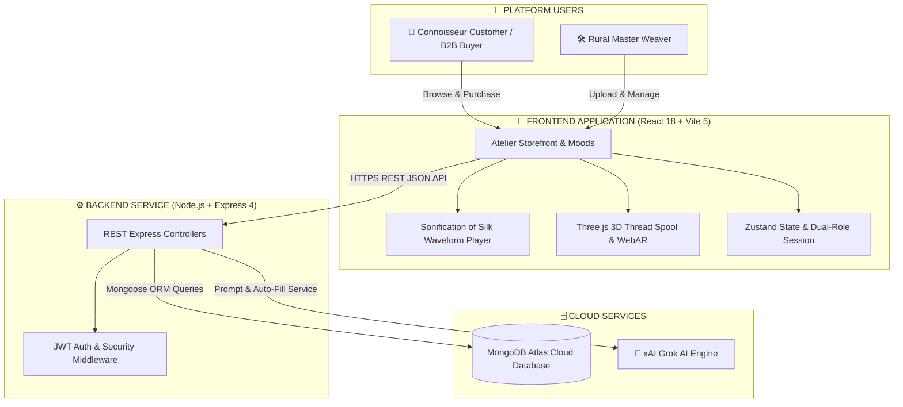
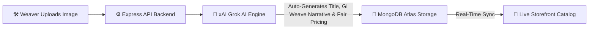
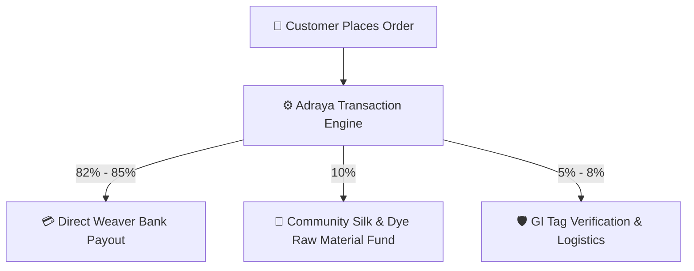
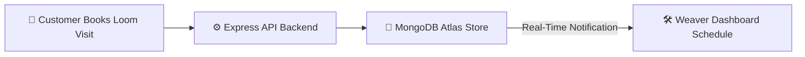

# 👑 ADRAYA (WeaveHeritage Lux) — Indian Luxury Heritage Atelier

<p align="center">
  
</p>

<p align="center">
  <strong>Direct Pit Loom Handloom Atelier • GI-Certified Heritage Provenance • Grok AI Engine • Interactive 3D Canvas</strong>
</p>

<p align="center">
  <a href="https://github.com/HardikMathur11/Adraya"></a>
  <a href="#-tech-stack"></a>
  <a href="#-system-architecture"></a>
  <a href="#-grok-ai-engine-integration"></a>
</p>

---

## 🔗 Live Production Links

- **🌐 GitHub Repository**: [https://github.com/HardikMathur11/Adraya](https://github.com/HardikMathur11/Adraya)
- **🚀 Live Backend Server (Vercel)**: [https://adraya-phc4.vercel.app/api/health](https://adraya-phc4.vercel.app/api/health)
- **🛍️ Live Storefront Prototype**: [https://adraya.vercel.app](https://adraya.vercel.app)

---

## 🌟 Executive Summary & Vision

**Adraya** (built as the realization of the **WeaveHeritage Lux** blueprint) is a heritage-luxury digital marketplace designed to position Indian handloom as a high-value cultural luxury. Rather than treating handloom as general commodity e-commerce, the platform shifts the narrative: **the story of the maker, the scarcity of the weave, and the time invested become the primary value signals.**

Adraya offers a dual-pathway ecosystem:
1. **Luxury Retail**: For premium individual connoisseurs seeking rare, authentic, certified drapes.
2. **B2B Heritage Sourcing**: For design houses, boutiques, and exporters looking to secure authentic, cluster-level orders directly from rural artisans.

---

## ⚡ The Problem vs. The Solution

### ❌ The Problem
- **Middleman Exploitation**: Rural weavers operate through complex distributor networks, capturing under 15% of the end consumer retail price and leaving them financially vulnerable.
- **Exclusivity Deficit**: High-net-worth individual (HNWI) buyers are willing to pay premium prices but lack access to verified origin records, artisan lineage stories, and guaranteed handloom authenticity.
- **Traceability Gap**: Designers and boutique owners face supply chain uncertainty, quality fluctuations, and counterfeit products when purchasing bulk handlooms.

###  The Solution
- **Atelier Direct-to-Consumer Model**: Direct selling channels with verified **82%+ direct-to-weaver bank payouts** visible on the digital invoice.
- **Multilingual Low-Bandwidth Onboarding**: Master weavers easily register using vocal guidance, upload products, and manage their listings.
- **Traceability Passports**: QR-linked interactive digital passports containing loom hours, yarn counts, and Geographical Indication (GI) registry certifications.

---

##  Core Hackathon Features Built & Operational

### 1. Curated Premium Storefront
- **Description**: High-end editorial design language, using a curated dark-cherry gold accent palette (`#3F0F17` & `#C9A227`) inspired by imperial court textiles.
- **Technical Highlight**: Integrated with **Three.js WebGL (via React Three Fiber)**, featuring a floating 3D Gold Thread Spool interactive canvas right over the homepage hero.

### 2. Traceability & Provenance Passports
- **Description**: Every product contains a unique QR-based digital passport listing the GI tag registry number, material specs (e.g. *300D Mulberry Silk*), days of labor, and the specific village origin.
- **Technical Highlight**: Interactive unfold passport visualization page displaying the authentic physical lineage of the craft.

### 3. Heritage Storytelling Engine
- **Description**: Rather than typical technical specs, product pages read like curated narratives detailing the cultural significance of the motifs (e.g., *Double-Peacock motif representing grace and royal protection*).

### 4. Emotion-Based Shopping (Atelier Moods)
- **Description**: Replaced generic product filters with a curated mood discoverer.
- **Occasions**: Connoisseurs shop by curated heritage moods: **Wedding Aura, Royal Splendor, Heirloom Gift, Quiet Luxury, Sustainable Luxe, and Temple Heritage**.

### 5. B2B Bulk Collaboration Portal
- **Description**: Dedicated wholesale request system enabling export houses and designers to submit Requests for Quotations (RFQs) for cluster-level bulk orders.
- **Technical Highlight**: Leverages collaborative weaver splitting logic to fulfill large orders without sacrificing artisan quality.

### 6. Sonification of Silk (Sensory Experience)
- **Description**: Integrated real audio signature waveforms of the handloom loom shuttle sounds recorded live at rural weaver cottages.
- **Technical Highlight**: Waveform player brings the loom to life right as the customer inspects the texture of the drape.

### 7. AI Brand Assistant (xAI Grok Integration)
- **Description**: Connected to the Grok API to auto-generate product stories, calculate luxury fair-trade pricing based on raw materials/labor hours, and generate social captions.
- **Technical Highlight**: Weaver auto-fill listing engine uses Grok to generate complete listings with 1 click.

### 8. Weaver Education & Empowerment Hub
- **Description**: Structured training portal for rural artisans covering export compliance, luxury product packaging, photography guidelines, and fair-wage calculation metrics.

### 9. Sizing & Fit Guidance
- **Description**: Integrated universal size charts and draping guides to eliminate returns and boost buyer confidence.

### 10. Loom Visit & Experiential Travel Booking
- **Description**: Experiential tourism module allowing premium buyers to book physical weaving workshops, local village heritage tours, and live loom studio slots.

---

## 🛠️ Tech Stack

| Layer | Technology Used | Implementation Purpose |
| :--- | :--- | :--- |
| **Frontend** | **React 18 / Vite 5** | High-speed Single Page Application with optimized bundle splitting |
| **Styling** | **Tailwind CSS** | Premium custom typography and theme colors with gold zari accents |
| **3D Engine** | **Three.js WebGL** | `@react-three/fiber` & `@react-three/drei` interactive spool canvases |
| **State** | **Zustand** | Multi-role user session stores and lightweight cart management |
| **Backend** | **Node.js / Express** | REST API Microservice controllers for products, authentication, and visits |
| **Database** | **MongoDB Atlas** | Mongoose ORM managing users, products, and loom visit bookings |
| **AI Layer** | **xAI Grok API** | Powered by `grok-beta` for chatbot, auto-fill, and story generation |
| **Auth** | **JWT & Bcrypt** | Secure encryption for Customer and Weaver profiles |

---

## 🏗️ System Architecture



---

## 🔄 Core Platform Workflows

### 1. Weaver Onboarding & AI Listing Workflow



### 2. Direct Payout & Pricing Split Logic



### 3. Loom Visit & Community Booking Workflow



---

## 👥 Pre-Configured Test Accounts (MongoDB Atlas)

The database includes **12 pre-configured accounts** for testing:

| Role | Email | Password | Craft Specialty / Location |
| :--- | :--- | :--- | :--- | :--- |
| **Master Weaver** | `radha@adraya.in` | `AdrayaPass123` | Double-Ikat Silk (Pochampally, Telangana) |
| **Master Weaver** | `lakshmi@adraya.in` | `AdrayaPass123` | Korvai Temple Borders (Kanchipuram, TN) |
| **Master Weaver** | `bipul@adraya.in` | `AdrayaPass123` | Wild Golden Muga Silk (Sualkuchi, Assam) |
| **Master Weaver** | `ghulam@adraya.in` | `AdrayaPass123` | Kani Needle Pashmina (Srinagar, Kashmir) |
| **Master Weaver** | `gurudev@adraya.in` | `AdrayaPass123` | Real Gold Zari Kadwa (Varanasi, UP) |
| **Master Weaver** | `savita@adraya.in` | `AdrayaPass123` | Yeola Paithani Peacock (Maharashtra) |
| **Customer** | `ananya@gmail.com` | `AdrayaPass123` | Connoisseur Collector |
| **Customer** | `priya@boutiquesilk.com` | `AdrayaPass123` | Luxury Boutique Buyer |

---

## 💻 Local Setup & Installation

### Prerequisites
- Node.js v18.0.0 or higher
- npm v9.0.0 or higher

### 1. Backend Service Setup
```bash
# Navigate to Backend directory
cd Backend

# Install dependencies
npm install

# Seed initial database (Populates master accounts & handloom products in MongoDB Atlas)
npm run seed

# Launch Backend Server (http://localhost:5001)
npm run dev
```

### 2. Frontend Storefront Setup
```bash
# Open a new terminal and navigate to Frontend directory
cd Frontend

# Install dependencies
npm install

# Launch Vite Development Server (http://localhost:5173)
npm run dev
```

---

<p align="center">
  Crafted with precision for India's Living Handloom Heritage.
</p>
